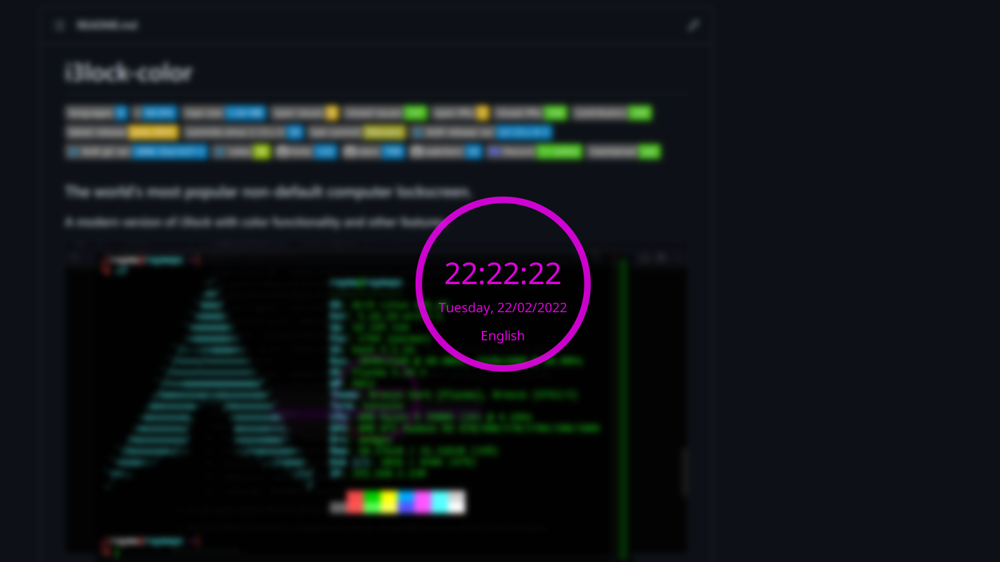

# i3lock-color

### اگر میخواین که یک i3lock خوشگل مثل پایین داشته باشین با من همراه باشید 




## Dependencies


### Arch Linux

#### برای نصب کردن توی محیط arch اول از همه با کامند پایین i3lock رو نصب کنید

```
sudo pacman -S i3lock
```

### بعد از نصب کردن دستور زیر رو به ترتیب وارد کنید توی ترمینال

```
git clone https://aur.archlinux.org/i3lock-color.git
cd i3lock-color
makepkg -Acs
sudo pacman -U i3lock-color-2.13.c.5-1-x86_64.pkg.tar.zst
```

## اجرا کردن i3lock زیبا

### بعد از نصب اتمام مراحل بالا و انجام نصب به ادرس پایین میریم و یک پوشه به اسم scripts میسازیم و بعد فایل lockرو داخل این پوشه قرار بدین

```
mkdir -p .config/scripts
```


### بعد از انجام این کارا برین داخل مسیر زیر

```
vim .config/i3/config
```

### متن زیر رو داخل اون قرار بدین

```
bindsym $mod+x exec /home/ali/.config/scripts/lock
```

### الان شما یک بار i3 خود را refresh کنید و کلد mod+x$  را بزنید (دکمه پنجره بعلاوه x)
